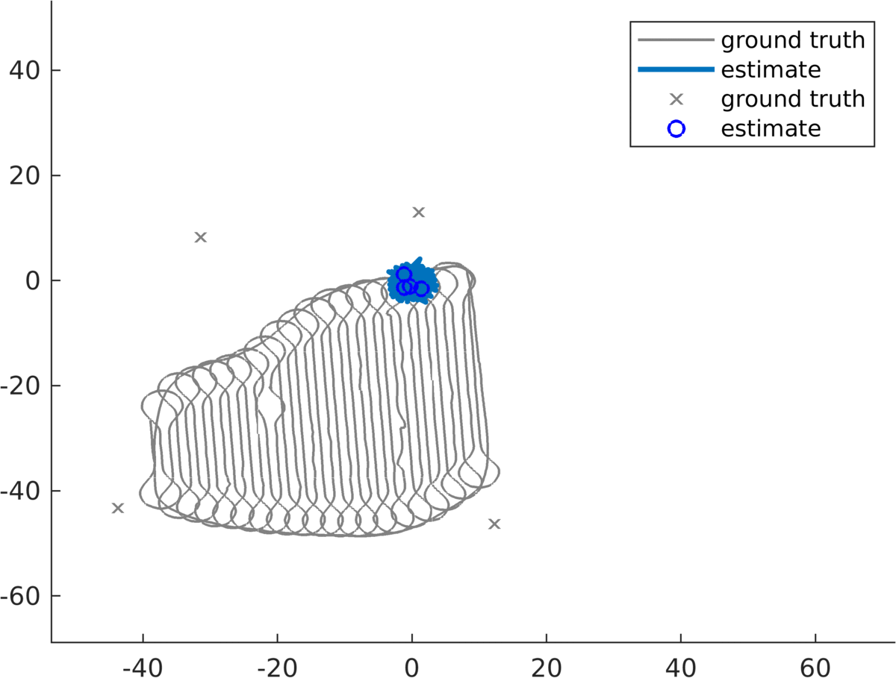
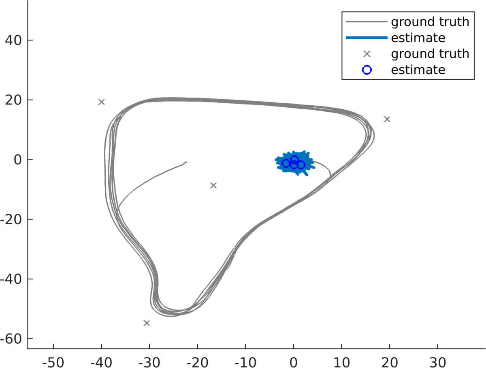

# Certifiably Correct Range-Aided SLAM (CORA)

This is the official repository for the paper ["Certifiably Correct Range-Aided SLAM"](https://arxiv.org/abs/2302.11614) by
[Alan Papalia](https://alanpapalia.github.io), Andrew Fishberg, Brendan O'Neill, [Jonathan P. How](https://www.mit.edu/~jhow/),
[David M. Rosen](https://david-m-rosen.github.io/) and [John J. Leonard](https://meche.mit.edu/people/faculty/JLEONARD@MIT.EDU).

For now we provide a simple MATLAB implementation, primarily as a demo piece for extension and comparison.

To see how CORA works and play around with various things, please look at the
file `MATLAB/main.m`. We have several example data files stored in `data/MATLAB`
for you to try out.

## Examples

Here is CORA in action on the Plaza1 and Plaza2 experiments from the
[CMU Navigating with Ranging Radios Dataset](https://infoscience.epfl.ch/record/283435)

<!-- make these two GIFs side-by-side and equal in size -->

  
  

## Feedback, Support, and Contributions

Any feedback, issues, or contributions are welcome and encouraged! We'll do the best we can to provide support for hopeful users.

Python and C++ implementations are hopeful future contributions. Please reach out if you are interested in contributing!

Enjoy!
